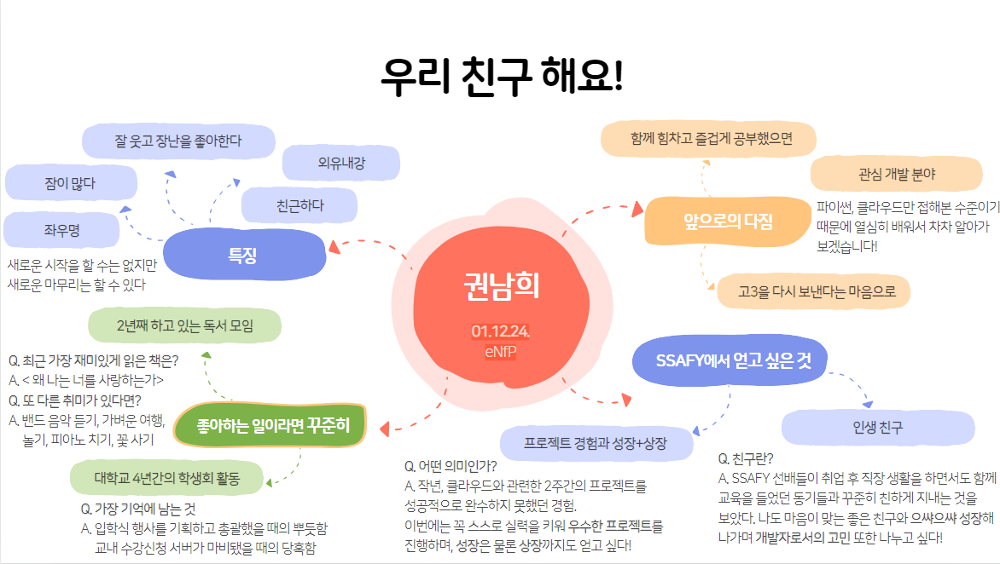

  

  

  

  <h3 style="color: #2C3E50;">✨ 저는 함께 일하고 싶은, 실력 있는 개발자가 되고 싶습니다.</h3>
  <h3 style="color: #2C3E50;">🎓 현재는 SFY 12기 G캠 회장을 맡고 있습니다.</h3>
  <h3 style="color: #2C3E50;">🌱 개발자 동료로서 함께 성장해나가요!</h3>

